# Enhancing X Company's Network Infrastructure through Multiple ISP Integration and High-Availability for Secure and Reliable Data Transmission

A capstone project presented to the Faculty of the College of Computing and Information Sciences, **University of Makati**, in partial fulfillment of the requirements for the degree **Bachelor of Science in Information Technology (Information and Network Security Elective Track)** — May 2026.

**Researchers:** Ralph Christian N. Altez · Clyde Jayser P. Aragon · Ken Brian U. Nafarrete

> **Note on naming.** The client organization is referred to throughout as **X Company**. It is a real e-commerce business that granted access for this study; its name is withheld here because the documentation describes weaknesses in its network. The full manuscript, with the organization named, is available on request.

---

## Abstract

> The objective of this study was to improve X Company's network infrastructure by designing a secure, reliable, and resilient WAN-LAN architecture that allows for seamless connectivity, secure data transmission, and better network management. The proposed infrastructure aimed to overcome the shortcomings of the current network, such as manual ISP switching, low levels of redundancy, poor network segmentation, and a lack of central monitoring.
>
> The methodology followed was developmental and simulation-based, and the network was designed and tested in GNS3 and VMware Workstation. The design featured multiple ISP connections with automatic failover, HA cluster configuration with two FortiGate firewalls, HSRP for Gateway redundancy, VLAN segmentation, PVST, Site-to-Site IPsec VPN, FortiGate web filtering and application control, and Wazuh monitoring and logging.
>
> The test results revealed successful HSRP failover, High Availability failover for firewall, ISP failover, secure inter-branch communication using IPsec VPN, web filtering enforcement, application control, and security event detection using Wazuh. The result of the ISO/IEC standard evaluation was an overall mean score of 3.73 (Very Good), showing that the proposed infrastructure has an acceptable level of reliability, security, business continuity, monitoring, and overall system quality. The study demonstrates that the proposed network infrastructure is a viable and effective solution to enhance X Company's connectivity, security, manageability, and continuity of operations in an enterprise environment.

**Keywords:** Multiple ISP Integration, ISP Failover, High Availability, IPsec VPN, Network Security

---

## Proposed network architecture

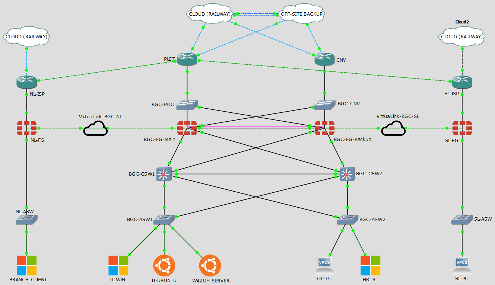

> The proposed design is a structured WAN-LAN design that brings the main branch and the remote branches together by site-to-site IPsec-VPN tunnels and by communication controlled via firewalls, as compared to the existing flat network.
>
> Multiple Internet connections via separate ISP links are provided for design redundancy and continuous connectivity. The main branch has two FortiGate firewalls in an Active-Passive High Availability (HA) cluster at the perimeter layer. This means that the backup firewall will kick in when the primary one fails, minimising downtime and enhancing business continuity.
>
> The core layer consists of two Layer 3 core switches configured with HSRP and PVST. HSRP operates by designating one core switch as the active gateway to the network, while the other core switch remains on standby. PVST keeps switching loops from forming and provides stable Layer 2 forwarding per VLAN. The access layer is below the core layer and is used to connect endpoint devices using VLAN-pruned trunk links.
>
> Traffic is logically partitioned by department with the use of departmental VLANs: IT, Operations, and HR. This enhances network organization, minimizes unnecessary broadcast traffic, and further enhances the security of the internal network by minimizing exposure between departments.

The whole environment was built and tested in **GNS3** and **VMware Workstation** — three sites (BGC main branch, NL branch, SL branch), dual ISPs (PLDT and Converge), a FortiGate HA pair, two Layer 3 core switches, two access switches, a Wazuh server, and Windows/Ubuntu endpoints.

---

## Security monitoring and detection

Wazuh was deployed as the centralized monitoring platform, with agents on an Ubuntu endpoint (`IT-Dept`, agent 001) and a Windows 10 endpoint (`Prod_Windows`, agent 002). Attacks were simulated against the environment and the resulting detections were captured from the Wazuh dashboard.

### SSH brute force → detection → automated block

An SSH brute-force attack was launched from Kali against the Ubuntu endpoint. Wazuh recorded the authentication failures, escalated at the brute-force threshold, and the Active Response module blocked the source IP.

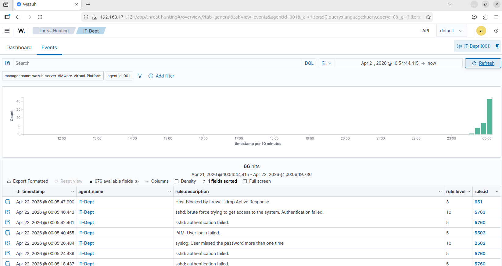

| Rule ID | Level | Description |
|---|---|---|
| 5760 | 5 | `sshd: authentication failed.` |
| 5503 | 5 | `PAM: User login failed.` |
| 2502 | 10 | `syslog: User missed the password more than one time` |
| 5763 | 10 | `sshd: brute force trying to get access to the system. Authentication failed.` |
| 651 | 3 | `Host Blocked by firewall-drop Active Response` |

> Figure 27 showcases the Wazuh event log under the threat hunting category, wherein multiple related security alerts were observed in its dashboard, indicating failed SSH authentication, failed PAM login attempts, and repeated incorrect password behavior. The logs confirm that Wazuh was able to monitor and detect the unusual behavior in real time. After the brute-force threshold was met, the Wazuh Active Response triggered and blocked the attacker's IP address.

### Malware detection via VirusTotal integration and Active Response

The EICAR anti-malware test file was downloaded onto the monitored Windows endpoint with Defender temporarily disabled, so that Wazuh's own detection and response path could be exercised end to end.

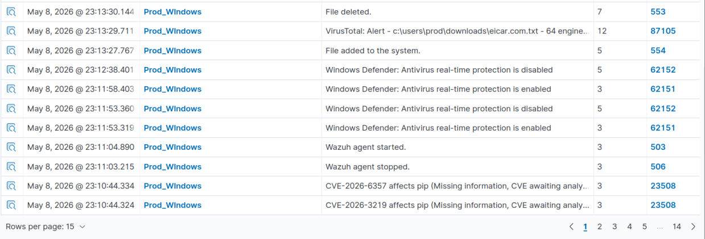

| Rule ID | Level | Description |
|---|---|---|
| 554 | 5 | `File added to the system.` |
| 87105 | 12 | `VirusTotal: Alert - c:\users\prod\downloads\eicar.com.txt - 64 engines detected this file` |
| 553 | 7 | `File deleted.` (Active Response) |

> The result confirms that Wazuh was able to detect the EICAR anti-malware test file, verify the file through VirusTotal integration, generate a security alert, and perform an automated response. This validates the capability of Wazuh to support malware detection, incident visibility, automated mitigation, and security-event analysis within the simulated environment.

### File integrity monitoring

Changes to monitored department files were detected by `syscheck` and reported as rule **550 — `Integrity checksum changed.`** (level 7), covering paths such as `c:\departmentfiles\hr\contracts.txt` and `c:\departmentfiles\hr\client_list.txt`.

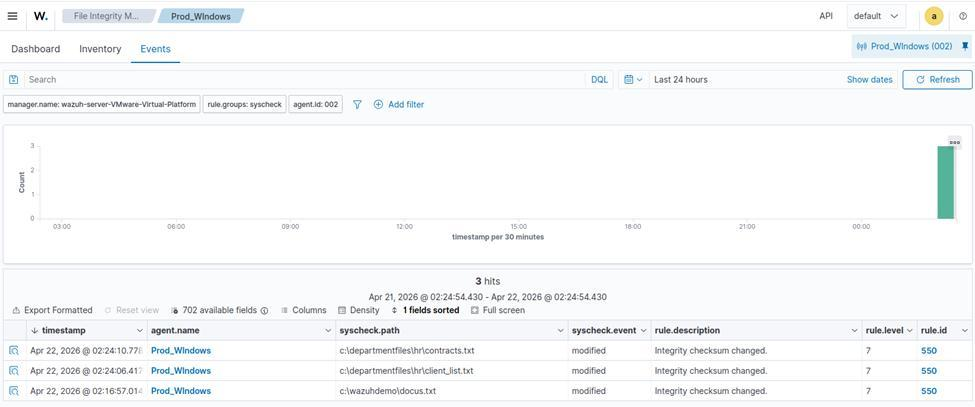

### Vulnerability detection and security configuration assessment

The Syscollector module inventoried the Windows endpoint and returned **1,714 vulnerability findings** with CVE identifiers and severities. Security Configuration Assessment was run against the **CIS Microsoft Windows 10 Enterprise Benchmark v4.0.0** — 424 checks, 117 passed, 302 failed, 5 not applicable, for a 27% score.

| Vulnerability inventory | CIS benchmark assessment |
|---|---|
| 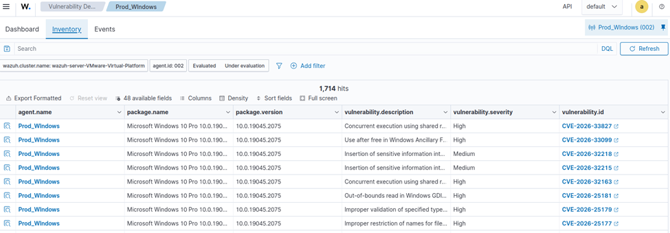 | 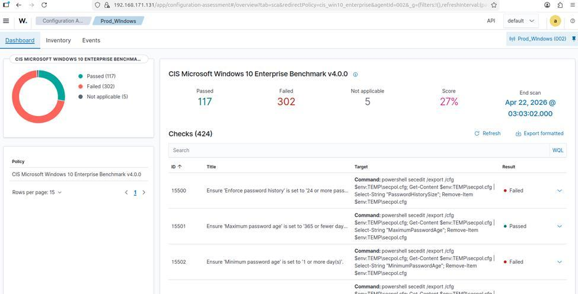 |

### Windows Defender log visibility

464 Defender-related events were collected through the Wazuh agent, giving visibility into antimalware scans, definition updates, real-time protection state changes, and service creation on the endpoint.

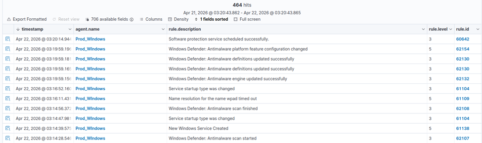

---

## Web application penetration testing

The cloud-hosted web application (Node.js/Express + MySQL, deployed on Railway, fronted by Cloudflare) was attacked at its `/auth/login` endpoint.

> To assess the security of the proposed web application, brute-force and SQL injection attacks were conducted against the login endpoint. The results showed that Cloudflare rate limiting, Turnstile validation, and application logging were able to detect, record, and mitigate the attack attempts. No successful authentication bypass or SQL injection was achieved, indicating that the implemented security controls were effective in protecting the website against common web-based attacks.

| Test | Tooling | Result |
|---|---|---|
| Credential brute force | Burp Suite Intruder | Mitigated by Cloudflare rate-limiting rule and Turnstile token validation; attacker IP blocked, `429 Too Many Requests` returned |
| Manual SQL injection | `' OR 1=1 --` in login form | Captured in Railway application logs; no authentication bypass |
| Automated SQL injection | sqlmap against POST `email`/`password` | No injectable parameters identified; multiple `400 Bad Request` plus Cloudflare `429` responses from exceeding the request threshold |

| Cloudflare blocks the brute force | Rate-limit events during sqlmap |
|---|---|
| 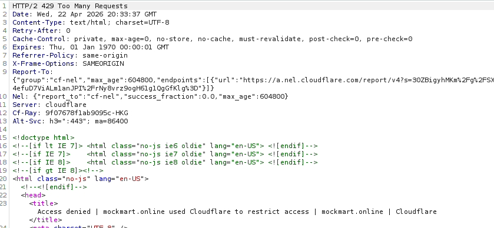 | 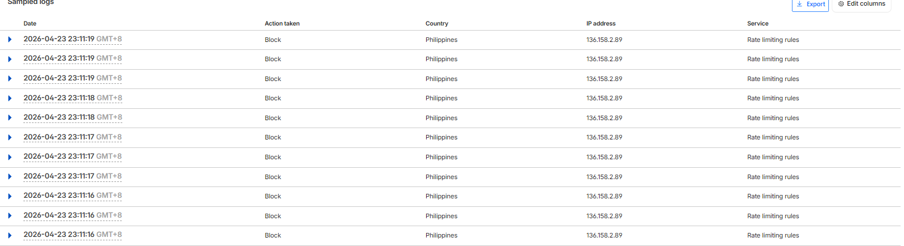 |

---

## Resilience and failover testing

| Test | Scenario | Result |
|---|---|---|
| HSRP reroute | Active core switch CSW1 (192.168.1.34) becomes unreachable | Traffic was rerouted to the standby CSW2 (192.168.1.35), confirming that HSRP maintained internal gateway availability |
| HSRP backup takeover | CSW1 is no longer active | CSW2 changed from standby to active, confirming successful backup takeover |
| HSRP preemption | CSW1 becomes available again after failure | CSW1 took over again because its priority was set higher than CSW2 |
| FortiGate HA failover | The primary firewall is placed in a down state | The backup firewall took over through the monitor and heartbeat ports, and the PC was still able to ping the internet |
| ISP failover | The primary ISP path (100.100.100.1) is down | The firewall automatically shifted to the second ISP (200.200.200.1), maintaining network connectivity |
| IPsec VPN connectivity | Ping between main branch and SL branch | Bidirectional reachability confirmed across the tunnel |
| IPsec encryption | `diag vpn tunnel list` during active branch traffic | The tunnel showed non-zero encrypted and decrypted values, confirming successful and secure IPsec VPN transmission |

| FortiGate HA failover | ISP failover path change |
|---|---|
| 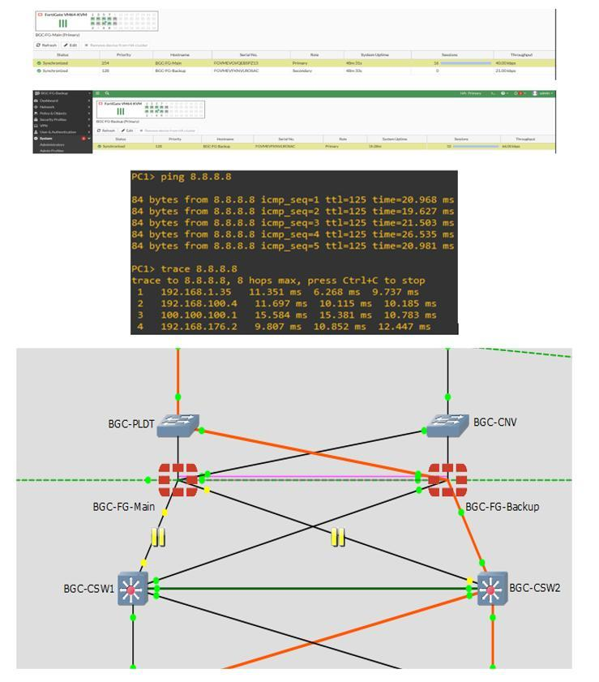 | 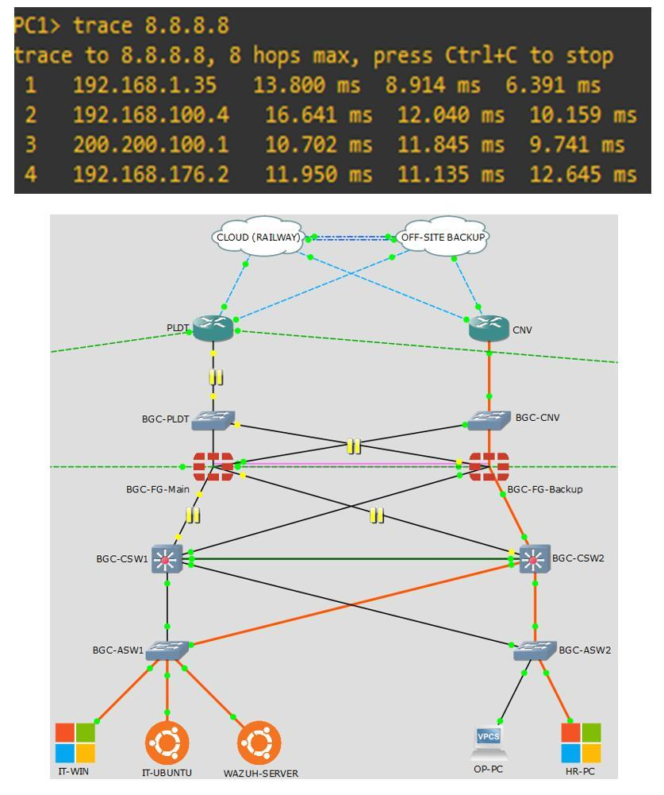 |

---

## Evaluation result

Evaluated against selected ISO/IEC standards — ISO/IEC 27001 (information security management), ISO/IEC 27033 (network security), ISO 22301 (business continuity), ISO/IEC 20000-1 (IT service management), and ISO/IEC 25010 (system and software quality).

| Criteria | ISO/IEC Standard Basis | Average Rating | Interpretation |
|---|---|---|---|
| System Evaluation | ISO/IEC 25010, ISO/IEC 20000 | 3.74 | Very Good |
| Reliability and Business Continuity | ISO/IEC 22301, ISO/IEC 25010 | 3.78 | Very Good |
| Information Security and Network Protection | ISO/IEC 27001, ISO/IEC 27033 | 3.72 | Very Good |
| Monitoring, Logging, and Auditability | ISO/IEC 27033, ISO/IEC 20000 | 3.70 | Very Good |
| Overall Acceptability of the Proposed Infrastructure | ISO/IEC 25010, 22301, 27001, 27033 | 3.70 | Very Good |
| **Overall Average Rating** | — | **3.73** | **Very Good** |

---

## Technologies used

| Category | Tool / Technology |
|---|---|
| Simulation | GNS3 |
| Virtualization | VMware Workstation |
| Firewall | FortiGate VM (Active-Passive HA, web filtering, application control, SD-WAN failover) |
| Routing & switching | Layer 3 core switching, inter-VLAN routing, HSRP, PVST, VLAN segmentation, VLSM subnetting |
| Secure transport | Site-to-Site IPsec VPN |
| Server OS | Windows Server 2022 (DHCP, DNS, Active Directory) |
| Monitoring & detection | Wazuh (log collection, intrusion detection, FIM, vulnerability detection, SCA, Active Response, VirusTotal integration) |
| Offensive tooling | Burp Suite, sqlmap, Kali Linux, EICAR test file |
| Web application | Node.js, Express.js, EJS, Tailwind CSS, MySQL, Railway, Cloudflare |

---

## Repository contents

| Path | Contents |
|---|---|
| [`docs/01-problem-and-objectives.md`](docs/01-problem-and-objectives.md) | Statement of the problem, background, objectives, scope and limitations |
| [`docs/02-system-architecture.md`](docs/02-system-architecture.md) | Existing vs. proposed design, system modules, workflow, project structure |
| [`docs/03-methodology.md`](docs/03-methodology.md) | Research design, requirements gathering, functional and non-functional requirements |
| [`docs/04-security-monitoring-and-detection.md`](docs/04-security-monitoring-and-detection.md) | Wazuh deployment, detections, penetration testing and firewall policy tests |
| [`docs/05-testing-and-results.md`](docs/05-testing-and-results.md) | Full test scenario tables and results for LAN, WAN, web, and monitoring |
| [`docs/06-conclusion-and-recommendations.md`](docs/06-conclusion-and-recommendations.md) | Summary of findings, conclusion, capabilities, limitations, recommendations |
| [`docs/figures/`](docs/figures/) | All figures and test evidence extracted from the manuscript |

---

## Scope and limitations

This project was designed, simulated, tested, and evaluated in a virtualized environment. It is a proposed enhancement and validation model, not a production deployment.

> The study is limited to a simulated and prototype-based environment. With this in mind, in actual use within a physical office environment, there may be variations in performance due to or not limited to the amount of user traffic levels, configuration changes, limitations of the environment, differences in hardware and ISP behavior, and actual physical cabling conditions.

Explicitly out of scope: full physical deployment in X Company's office, load balancing (the setup covers ISP failover only), full-lifecycle cost analysis, replacement of the existing production network, exhaustive OS/third-party application security testing, and long-term testing with real traffic volumes.

---

## A note on this repository

This repository documents an academic capstone study. The client organization is anonymized as X Company, and the full manuscript is not published here for the same reason. All network addresses, device names, and screenshots come from the simulated GNS3/VMware lab environment, not from any production network.

Copyright © 2026 Ralph Christian N. Altez, Clyde Jayser P. Aragon, and Ken Brian U. Nafarrete. Shared for academic and portfolio purposes.
