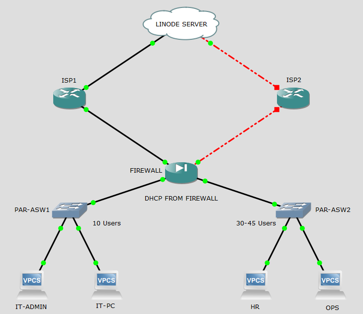
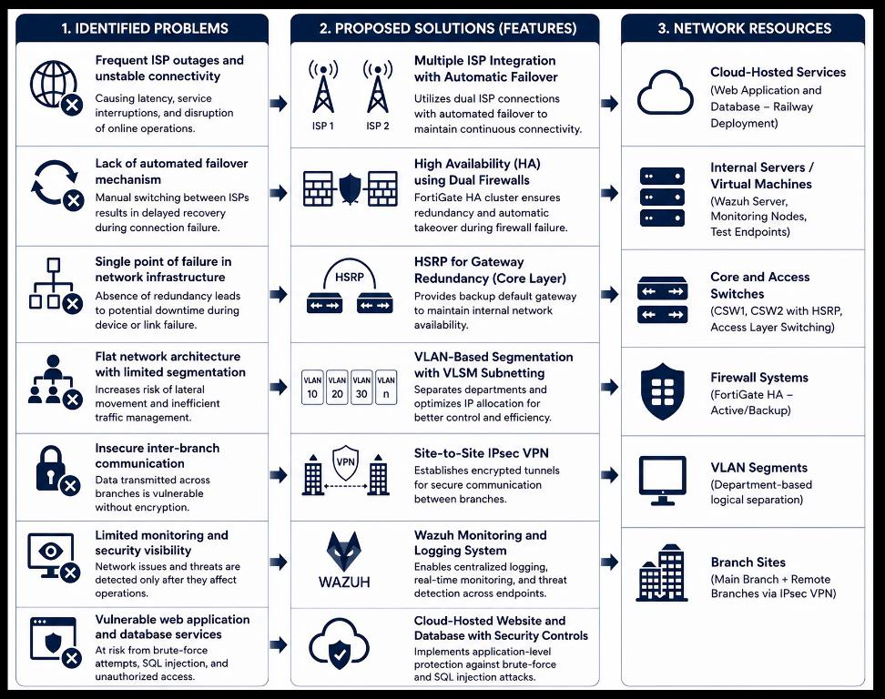

# Chapter 1 — The Problem and Its Background

*Text in this document is taken from the capstone manuscript.*

---

## Background of the study

X Company is an online grocery and retail delivery company operating in the Philippines. The study begins from the state of its network at the time of the research:

> X Company is currently on an entire floor in a new building. The company already has at least two Internet Service Providers (ISPs) for its current network condition, which are Converge and Globe. The current system, however, is not fully automatic and is kept simple. Both connections to ISPs are provided, but the secondary connection is only used if the primary connection slows or fails, which often necessitates manual switching. This means that the current configuration has some level of connectivity redundancy, but there is a need to create a more structured and resilient design in order to ensure seamless continuity and efficient traffic handling.

> Moreover, the existing network configuration still has certain restrictions that can have an impact on future operation. The current infrastructure present within the organization itself is quite basic; there is no structured redundancy, and automated failover is not present. As the company continues to grow, the need for better segmentation, traffic control, and more secure branch-to-branch communication increases.

### Existing network layout

> The figure shows the network topology of X Company at the present time. It illustrates the company's current network configuration at its new location, with the organization covering the whole floor of the office building and operating with a relatively simple network infrastructure and making use of two ISP connections. Both ISPs are available, but the secondary Internet connection is still manually switched when the primary Internet connection is slow or down. The figure thus represents the current state of the network at the company and is used to determine the need for a more resilient, secure, and scalable network design.

---

## Statement of the problem

> The goal of this study is to enhance the reliability, security, continuity, and monitoring of the network infrastructure in X Company. The purpose of this study is to provide some answers to the following questions:
>
> - What do multiple ISP connections and failover mean for X Company for greater network reliability and business continuity?
> - What are the benefits of implementing a structured WAN-LAN design for the communication and connectivity between the main office and remote branches?
> - What role does secure communication between branches play to ensure the confidentiality and integrity of the data sent?
> - What is the effectiveness of the proposed measures for web security to protect the platform from the most common types of web attacks, including brute force, SQL injection, and unauthorized access?
> - What is the effectiveness of the proposed monitoring and logging framework of increasing the visibility and detection of events, and the level of administrative control of the network infrastructure?

---

## Objectives of the study

> The primary goal of this work is to create a secure, reliable, and resilient network infrastructure for X Company that would facilitate connectivity, ensure continuous business operation, facilitate inter-branch communications, and increase monitoring and protection of cloud-based services.
>
> Specifically, the study aims to:
>
> 1. **Create a structured WAN-LAN network design** for X Company, which links the main branch and remote branches together in an organized and manageable network.
> 2. **Enhance inter-branch and internet connectivity** via multiple ISP integration, ISP failover, and secure site-to-site communication.
> 3. **Improve internal network organization** by implementing VLAN segmentation, subnetting, HSRP addressing, PVST addressing, and implementing gateway redundancy.
> 4. **Integrate cloud-based resources and security measures** to improve the security and access to cloud-connected services.
> 5. **Adopt a centralized monitoring, log, and auditing system** to gain visibility of network and system activities.
> 6. **Assess the proposed infrastructure based on internationally recognized criteria** to ensure that it is best practice in information security, network security, business continuity, IT service management, and system/software quality.

### Standards used

> - ISO/IEC 27001:2022 – Information Security Management System
> - ISO/IEC 27033-1:2015 – Network Security Framework
> - ISO 22301:2019 – Business Continuity Management System
> - ISO/IEC 20000-1:2018 – IT Service Management System
> - ISO/IEC 25010:2011 – Systems and Software Quality Requirements and Evaluation

---

## Significance of the study

> The study proves to be significant as it presents a practice network topology for the company named X Company, which has consistently encountered lapses in its current network infrastructure. The implementation of automatic failover systems between multiple ISPs, the use of a High-Availability network infrastructure, a WAN-LAN network architecture, establishment of a Site-to-Site VPN connection between their office and store locations, and through the implementation of methods to monitor those networks will allow the company to achieve their goal of reducing downtime within their network, improving the security of their network, and ensuring that the business continues to operate in accordance with its goals.

**For X Company** — a network infrastructure that proves to have a more reliable and secure network, which promotes and supports business continuity, provides improved connectivity, and reduces interruptions within their service.

**For employees** — an improved experience with the company's network infrastructure, allowing them to increase their productivity and their performance within the company.

**For customers** — fewer disruptions in their transactions with the company, and their data will be more secure during those transactions.

**For the IT team** — network administrators will be able to monitor the network and its activities, log those activities, audit those logs to assess any security events within the network, and generally manage the network infrastructure more efficiently.

**For future researchers** — a reference for future research projects that include multiple ISP integration, ISP failover, High Availability, WAN-LAN design, Site-to-Site IPsec VPN, web security, and centralized monitoring in enterprise network environments.

**For the IT industry in the Philippines** — it shows how the digital business concepts of the modern network infrastructure can be applied to the local digital business. It could also be a real-world instance of enhancing the reliability, security, and operating resilience of e-commerce and cloud-based systems.

---

## Scope and limitations

> This research is mainly concerned with the design, simulation, testing, and evaluation of a better network infrastructure for X Company. Topics include the implementation of a structured WAN-LAN architecture interconnecting the main branch and remote branch, the integration of multiple ISP connections with ISP failover, High Availability (HA) mechanisms, VLAN-based segmentation, HSRP and PVST addressing, gateway redundancy, and Site-to-Site IPsec VPN for secure inter-branch communication. Monitoring, logging, and auditing are also supported, with Wazuh being the monitoring tool, and web security controls are in place to safeguard cloud-connected services.

> The topology of the network will be designed and simulated in GNS3 and VMware Workstation. The network topology is going to be simulated using GNS3, which involves routers, firewalls, switches, ISP connections, failover, and VPN communication. VMware Workstation will be used for virtual machines and all other services required for testing, monitoring, and system validation. The testing will center on: Network Connectivity, ISP failover, HA behavior, secure VPN communications, web security response, and monitoring visibility.

### Excluded from the study

> - The full physical deployment of proposed infrastructure on X Company's actual office environment.
> - Load balancing, due to the current setup specifically covering and focusing on ISP failover only.
> - Cost analysis for procurement, installation, and maintenance of network equipment for the entire life cycle.
> - Complete replacement of the company's currently existing production network.
> - Full OS 100% cybersecurity testing of all user devices, third-party apps, and OS.
> - Real traffic and real user volume long-term testing.
> - Market analysis/commercial feasibility of proposed infrastructure.

> The study is limited to a simulated and prototype-based environment; the proposed design will prove to be beneficial. With this in mind, in actual use within a physical office environment, there may be variations in performance due to or not limited to the amount of user traffic levels, configuration changes, limitations of the environment, differences in hardware and ISP behavior, and actual physical cabling conditions.

---

## Problem–solution mapping

> The figure presents a structured mapping of the identified problems, proposed features, and supporting network resources, demonstrating how the proposed design addresses the problems of the existing infrastructure.

---

**Next:** [Chapter 3 — System Architecture and Design →](02-system-architecture.md)
