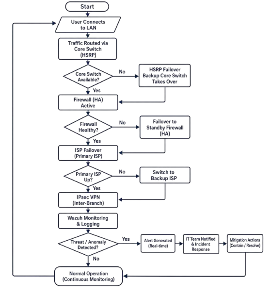
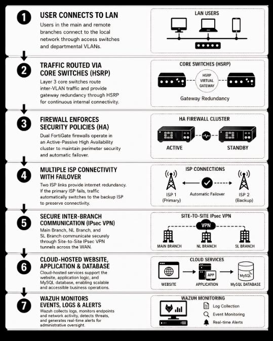

# System Architecture and Design

*Text in this document is taken from the capstone manuscript.*

---

## System overview

> This new system reorganizes X Company's network from a simple one-layer, one-ISP network to a multi-layered, segmented network with redundancy and controlled access policies. The existing network is a flat topology, which means that all the devices used by employees are connected to the same network, thus exposing them to security threats and limits in performance. The suggested system provides Departmental Segmentation (IT, HR, OP), Multi-ISP Integration for enhanced connectivity stability, Firewall-based security policy enforcement, and Centralized Management of network traffic. This architecture utilizes a modernized approach, which not only makes the network more fault-tolerant but also minimizes the volume of broadcast traffic, increases monitoring visibility, and brings the organization's network into line with enterprise-level networking.

---

## The existing network

> The existing infrastructure uses a single firewall that connects to one ISP for all inbound and outbound traffic. The company has 2 Internet Service Providers (ISPs) available, but both suffer from inconsistent performance and weather-related instability. Although the company has multiple ISPs, there is no present automatic failover; the connection has to be manually changed when the primary link fails. This introduces dependency on human response, which increases downtime during outages.

> All devices and departments are connected to the same network without any VLAN segmentation present; if one device were to be compromised, all the other endpoints are also at risk. Additionally, there is a single point of failure; if the switch fails, the entire company will experience an interruption and stop its operations.

> In addition, the infrastructure in place does not provide a defined Wide Area Network (WAN) architecture for the support of secure and reliable inter-branch connectivity. There is no single network design to integrate all the branches and no centralized control of the network, which is present in multiple locations, but leads to a low level of coordination, low efficiency, and possible security risks in the communication between branches.

The current network lacks:

> - Automated failover systems
> - High Availability firewalls
> - Structured VLAN segmentation enforcement
> - Centralized security policy control
> - Defined WAN architecture for scalable interconnectivity

---

## The proposed network

> Multiple Internet connections via separate ISP links are provided for design redundancy and continuous connectivity. The main branch has two FortiGate firewalls in an Active-Passive High Availability (HA) cluster at the perimeter layer. This means that the backup firewall will kick in when the primary one fails, minimising downtime and enhancing business continuity.

> The core layer consists of two Layer 3 core switches configured with HSRP and PVST. HSRP operates by designating one core switch as the active gateway to the network, while the other core switch remains on standby. PVST keeps switching loops from forming and provides stable Layer 2 forwarding per VLAN. The access layer is below the core layer and is used to connect endpoint devices using VLAN-pruned trunk links.

> Traffic is logically partitioned by department with the use of departmental VLANs: IT, Operations, and HR. This enhances network organization, minimizes unnecessary broadcast traffic, and further enhances the security of the internal network by minimizing exposure between departments.

> The proposed infrastructure also enables remote branches to communicate securely via Site-to-Site IPsec VPN. This enables the main branch, the NL branch, and the SL branch to securely share data over the WAN. In summary, the proposed design overcomes the current network constraints by implementing automatic failover, firewall redundancy, VLAN segmentation, secure branch connectivity, and scalable architecture to support X Company's.

---

## Existing vs. proposed

| Area | Existing Network Infrastructure | Proposed Network Infrastructure |
|---|---|---|
| Network Design | Uses a flat and single-layer network topology where departments are connected within the same general network. | Uses a structured WAN-LAN architecture with separate WAN, perimeter, core, access, and VLAN layers. |
| Branch Connectivity | No structured WAN architecture is implemented for secure and centralized inter-branch communication. | Connects the main branch and remote branches through a structured WAN design using Site-to-Site IPsec VPN. |
| ISP Connectivity | Uses multiple ISPs, but backup connection requires manual switching when the primary ISP fails. | Uses multiple ISP connections with automatic failover to maintain internet connectivity during ISP failure. |
| Redundancy | Limited redundancy; failure of key devices or links may interrupt business operations. | Implements redundancy through FortiGate High Availability, HSRP, and ISP failover. |
| Firewall Setup | Uses a single firewall, creating a possible single point of failure at the network perimeter. | Uses dual FortiGate firewalls in an Active-Passive High Availability cluster. |
| Internal Segmentation | No clear VLAN segmentation; HR, IT, and Operations devices share the same flat network. | Implements VLAN segmentation for HR, IT, and Operations to separate departmental traffic. |
| Core Network | Relies on a simple switching setup with limited gateway redundancy. | Uses two Layer 3 core switches configured with HSRP and PVST for gateway redundancy and loop prevention. |
| Access Layer | Devices are connected directly through a basic switching structure. | Uses Layer 2 access switches with VLAN-pruned trunk links for organized endpoint connectivity. |
| Failover Process | ISP backup is manual and depends on human intervention. | ISP and firewall failover are automated to reduce downtime and improve continuity. |
| Security Control | Minimal internal security separation and limited centralized security enforcement. | Uses FortiGate firewall policies, web filtering, application control, VLAN segmentation, and IPsec VPN encryption. |
| Monitoring and Logging | No centralized monitoring and logging system is shown in the existing layout. | Integrates Wazuh for centralized monitoring, logging, intrusion detection, vulnerability detection, and alerting. |
| Scalability | Limited scalability due to flat topology and lack of structured network layers. | More scalable due to layered architecture, VLAN design, WAN structure, and branch-ready connectivity. |
| Business Continuity | More vulnerable to downtime due to manual failover and single points of failure. | Supports business continuity through HA firewall clustering, automatic ISP failover, HSRP, and secure VPN communication. |
| Overall Capability | Basic office network suitable for simple connectivity but limited in redundancy, security, and branch integration. | Enterprise-oriented network infrastructure designed for reliability, security, scalability, and continuous operations. |

---

## System modules and features

| System Module | Features | Description |
|---|---|---|
| WAN Connectivity Module | Multiple ISP integration, ISP failover, and WAN connectivity | Provides internet and wide area connectivity for the organization. It integrates multiple ISP links to reduce dependency on a single provider and supports automatic failover when the primary ISP becomes unavailable. |
| LAN Infrastructure Module | Layer 2 access switching, endpoint connectivity, structured internal network | This module supports the internal office network by connecting endpoint devices, access switches, and departmental users within the local area network. |
| VLAN Segmentation Module | HR VLAN, IT VLAN, Operations VLAN | Separates the internal network into departmental VLANs to improve organization and improve control. |
| Core Switching and Gateway Redundancy Module | Layer 3 switching, inter-VLAN routing, HSRP, PVST | Manages internal network traffic between VLANs and provides gateway redundancy through HSRP. PVST is used to maintain stable switching behavior and prevent switching loops. |
| Firewall and Perimeter Security Module | FortiGate firewall policies, routing, NAT, traffic filtering | Protects the network by enforcing firewall rules, controlling inbound and outbound traffic, and securing communication between internal and external networks. |
| High Availability Module | Active-Passive FortiGate HA, heartbeat links, failover monitoring | This module ensures continuity of network services by allowing the backup firewall to automatically take over when the primary firewall fails. |
| Secure Inter-Branch Communication Module | Site-to-Site IPsec VPN, encrypted branch communication | This module allows the main branch and remote branches to communicate securely through encrypted VPN tunnels, ensuring the confidentiality and integrity of transmitted data. |
| Web Filtering and Application Control Module | FortiGate web filtering, application control, policy enforcement | This module regulates access to websites and applications based on configured security policies, helping prevent unauthorized or risky web and application activity. |
| Cloud-Connected Services Module | Cloud-hosted website, cloud-hosted database, and Railway deployment | This module represents the externally hosted application and database services used to support business operations and demonstrate cloud integration. |
| Monitoring, Logging, and Detection Module | Wazuh log collection, intrusion detection, file integrity monitoring, vulnerability detection, and active response | Provides centralized visibility over monitored endpoints and security events. It supports detection of suspicious activity, records logs, monitors file changes, identifies vulnerabilities, and enables active response to selected threats. |
| Testing and Validation Module | Ping testing, failover testing, VPN tunnel verification, Wazuh alert validation | Used to verify whether the proposed infrastructure functions as intended. Validates connectivity, redundancy, VPN encryption, failover behavior, and monitoring capability. |
| Simulation Environment Module | GNS3, VMware Workstation, virtual firewalls, and endpoints | Provides a virtualized environment where the proposed infrastructure is designed, configured, tested, and evaluated. |

---

## System workflow

The end-to-end path a packet takes through the proposed infrastructure:

> 1. User or endpoint device connects to the X Company local area network through the assigned access switch.
> 2. The access switch places the device traffic into its assigned departmental VLAN: IT VLAN 10, Operations VLAN 20, or HR VLAN 30.
> 3. The access layer forwards the VLAN-tagged traffic to the core switch layer through trunk links.
> 4. The core switch layer receives the traffic and performs inter-VLAN routing when communication between VLANs is required.
> 5. HSRP is used at the core layer to provide a virtual gateway for the VLANs, allowing users to continue sending traffic through a redundant gateway address.
> 6. The system checks whether the active core switch is available.
> 7. If the active core switch is available, traffic continues normally toward the firewall layer.
> 8. If the active core switch becomes unavailable, HSRP failover is triggered, and the backup core switch takes over as the active gateway.
> 9. PVST operates in the switching environment to prevent Layer 2 loops and maintain stable forwarding paths for each VLAN.
> 10. After passing through the core layer, traffic is forwarded to the active FortiGate firewall.
> 11. The active FortiGate firewall inspects, and filters traffic based on configured firewall policies, web filtering rules, and application control settings.
> 12. The system checks whether the active firewall is healthy.
> 13. If the active firewall is healthy, traffic continues toward the WAN/ISP layer.
> 14. If the active firewall fails, the standby FortiGate firewall automatically takes over through the Active-Passive High Availability configuration.
> 15. The FortiGate firewall then forwards permitted traffic toward the primary ISP connection.
> 16. The system checks whether the primary ISP is available.
> 17. If the primary ISP is available, traffic continues through the primary ISP connection.
> 18. If the primary ISP becomes unavailable, the firewall automatically switches traffic to the backup ISP connection to maintain network connectivity.
> 19. For internet-based access, permitted traffic is forwarded to external services.
> 20. For inter-branch communication, traffic is routed through the Site-to-Site IPsec VPN tunnel.
> 21. With the IPsec VPN, traffic between the main branch and remote branches, such as the NL Branch and SL Branch, is encrypted.
> 22. The VPN traffic is sent to and decrypted by the remote branch firewall; branch networks can communicate securely.
> 23. The simulated environment is continuously monitored for logs and security events from monitored endpoints and systems using Wazuh.
> 24. Wazuh monitors for potential threats or anomalies like brute force attacks, file changes, vulnerabilities, and unusual endpoint behavior.
> 25. If there is no threat or anomaly, the system continues in normal operation, with continuous monitoring.
> 26. When a threat or anomaly is detected, Wazuh will generate an alert in real-time.
> 27. The IT team assesses the alert and determines the problematic endpoint, system, or activity.
> 28. Mitigation actions are executed, which may include blocking the attacking IP, checking logs, isolating the infected system, or fixing the problem identified.
> 29. Once mitigation has been accomplished, the system reverts to normal operation.
> 30. Continuous monitoring is maintained to ensure the proper functioning of network connectivity, security controls, failover mechanisms, and inter-branch communication.

---

## Project structure

The project consists of the following main parts:

**1. Local Area Network (LAN)** — the network environment inside a branch. There are three branches, creating three different LANs, each using VLAN-based segmentation to segment departments, VLSM subnetting to allocate addresses efficiently, and its own DHCP server.

**2. Wide Area Network (WAN)** — connects the main branch to both sub-branches at geographically separated locations. Includes dual ISP connectivity, SD-WAN traffic management, automatic failover of ISP connections, and Site-to-Site IPsec VPN.

**3. Main Branch** — the central point of reference. The WAN side includes PLDT and CNV WAN connections (`BGC-PLDT`, `BGC-CNV`). The firewall is an HA cluster of FortiGates (`BGC-FG-Main`, `BGC-FG-Backup`). The core Layer 3 switches are `BGC-CSW1` and `BGC-CSW2`. The access Layer 2 switches are `BGC-ASW1` and `BGC-ASW2`.

**4. Sub-Branches** — remote operating sites connected via WAN, requiring reliable connectivity to reach central resources.

**5. Multiple ISP Integration** — two different ISPs, reducing dependency on a single connection and eliminating a single point of failure for internet access.

**6. ISP Failover** — automatically transfers from the primary link to the backup link during a failure, preventing downtime and retaining access to hosted services.

**7. High Availability using dual firewalls** — two firewalls in a redundant configuration providing perimeter security, routing, traffic filtering, and policy enforcement. If the primary firewall goes down, the secondary takes over.

**8. Core Switch Layer** — manages and directs internal traffic, provides VLAN routing for the entire LAN, connects access switches through trunked links, and provides gateway redundancy using HSRP.

**9. Site-to-Site IPsec** — protects WAN communication between branches through encryption and authentication of data in transit.

**10. Wazuh** — the project's monitoring and logging platform, used to gather security-related events, generate alerts, and aid in incident review.

**11. Cloud-Hosted Website and Database** — hosted on Railway. The website acts as the business application; the database manages system data storage.

**12. Front-End** — HTML5, Tailwind CSS, and EJS templates forming the presentation layer of the hosted web system.

**13. Back-End** — Node.js and Express.js providing the server-side environment that processes application logic and mediates between the interface and the database.

**14. Database** — a relational database (MySQL) storing and managing the application data required for the web system to operate.

---

## Stakeholder impact

> **For the IT team (network administrators)**, implementation of central monitoring and visibility using Wazuh will allow administrators to monitor real-time activity, logs, and security-related event activity occurring on the network. This will increase the administrator's ability to detect potential security risks and provide quicker responses to potential threats. Automated failover and redundant capabilities were implemented in order to reduce manual intervention due to failure of ISPs, firewalls, or gateways. Therefore, the Incident Response Capability has been greatly enhanced.

> **For employees (users)**, having redundant/failover mechanisms in place to ensure constant availability of network access will allow employees/users to continue accessing systems during periods of network disruption. Enhanced network topology and flow processing will also enhance employee/user speed/accessibility to applications and reduce latency in order to increase productivity due to fewer interruptions in daily tasks.

> **From the perspective of the organization (X Company)**, the proposed infrastructure will assist in maintaining business continuity by utilizing HA/Failover/Redundant mechanisms to keep operations running without interruption. Secure communication through IPsec VPN and web security controls will improve data protection and security/integrity while protecting customer-related data/information.

---

**Previous:** [← Chapter 1 — The Problem and Its Background](01-problem-and-objectives.md) · **Next:** [Chapter 3 — Research Methodology →](03-methodology.md)
