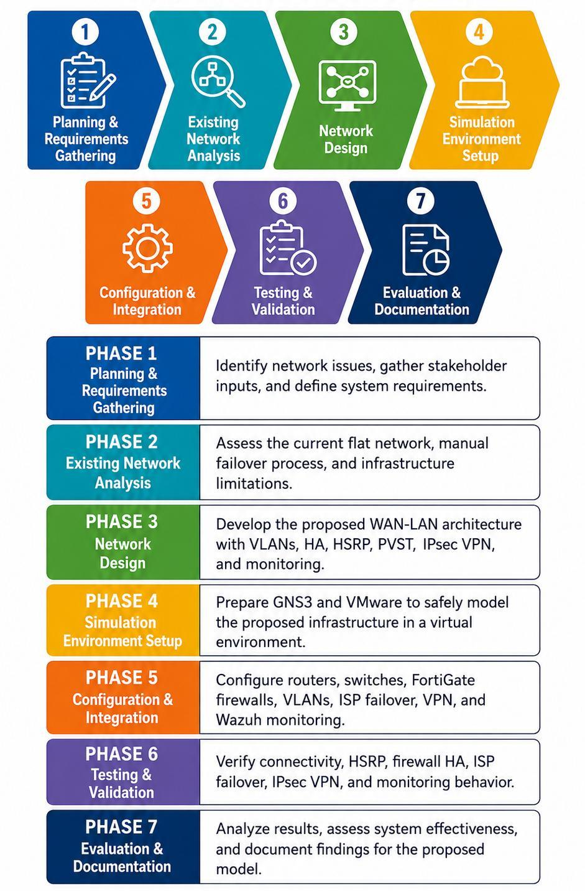

# Chapter 3 — Research Methodology

*Text in this document is taken from the capstone manuscript.*

---

## Research design

> The research design used in this project was a developmental and experimental design that employed a network simulation-based approach. It focused on the creation of the proposed network infrastructure for X Company and the evaluation of that network.

> The developmental aspect of the design centered on the planning and implementation of the network infrastructure, while the experimental aspect involved testing the created and implemented network under scenarios such as ISP failures, device failures, and cyberattacks. Developmental research was applied because it is commonly utilized in information technology and network engineering for the creation of new networks.

> The methodology was simulation-based, with all configurations and evaluations conducted in a virtual environment (GNS3 and VMware Workstation). This allowed enterprise networking concepts such as VLAN segmentation, HSRP, PVST, ISP failover, IPsec VPN, and HA to be tested safely and in a controlled manner.

> This approach was appropriate because it enabled both the development of a functional enterprise network model and the controlled experimentation necessary to validate its effectiveness, reliability, and security without disrupting real-world operations.

---

## Requirements gathering

> This research study, including the design and simulation of the proposed network infrastructure for X Company was carried out on the basis of requirements gathering, which served as the foundation for designing and simulating the system. This stage involved a series of interviews, consultations, and technical evaluations on-site to gain a deeper understanding of the organization's current network configuration, issues, and requirements.

### Stakeholder consultation

> The researchers employed purposive sampling technique in interviewing key individuals in X Company to accurately pinpoint the strategic and technical needs of the project.

> - **Head of the Tech Team:** A strategic interview was conducted with the Head to gain executive input. In this consultation, the key business concerns regarding network instability were addressed, along with the strategic importance of high availability to the e-business and the executive-level goals for strengthening the company's security posture.
> - **Senior Developer:** This consultation was crucial to get qualitative and technical information on the current problems in the network and their impact, such as the presence of "recurring network problems", a performance bottleneck, and information about the existing ISP configuration.
> - **HR Team Head:** A questionnaire was given to the HR Team Head to obtain a general background of the structure of the company, the number of users, and the major online applications utilized for company operations.

### Data collection methods

> 1. **Semi-Structured Interviews:** Qualitative data collection was the primary method used. The Vice President of the Tech Team and the Senior Developer were interviewed, allowing for detailed, open-ended conversations. These discussions led to the identification of specific technical challenges, business requirements, and stakeholder preferences.
> 2. **Questionnaires:** Basic data were gathered through a simple questionnaire administered to non-technical management, specifically the Head of the HR Team, to determine the operational dependency on the network.
> 3. **Existing System Analysis:** This stage involved identifying and documenting existing network assets, including the current network topology, ISP providers, routing configurations, and network-wide settings.

---

## Functional requirements

| Code | Functional Requirement | Description |
|---|---|---|
| FR-01 | Multiple ISP Integration | The system must integrate and manage at least two Internet Service Providers to ensure continuous and reliable internet connectivity. |
| FR-02 | High Availability Firewall Configuration | The system must implement an Active-Passive High Availability setup using FortiGate firewalls, where the primary firewall handles traffic, and the secondary firewall automatically takes over during failure using heartbeat and monitoring links. |
| FR-03 | Automatic ISP Failover | The system must automatically reroute traffic to backup ISP links in case of primary ISP failure or degradation to maintain uninterrupted connectivity. |
| FR-04 | VLAN-Based Network Segmentation and IP Addressing | The system must implement VLAN segmentation to separate departmental traffic and improve internal network organization. The main branch must use static IP, while remote branches must utilize DHCP with VLSM-based IP address allocation for efficient and dynamic host configuration. |
| FR-05 | Network Monitoring, Logging, and Intrusion Detection | The system needs to have an ability to monitor, log, and alert (intrusion detection, file integrity monitoring, vulnerability detection, and active response) the security events centrally through Wazuh. |
| FR-06 | Secure Inter-Branch Communication | The system must establish encrypted Site-to-Site IPsec VPN tunnels to ensure security. The system must enforce security through VLAN segmentation, FortiGate firewall policies, IPsec VPN encryption, and centralized monitoring with Wazuh. |
| FR-07 | Web Filtering and Application Control (FortiGate) | The system must have web filtering and application control with FortiGate firewalls, which are used to detect, regulate and block malicious or unauthorized traffic according to security policies. |
| FR-08 | Core Network Gateway Redundancy | The system should have gateway redundancy (Hot Standby Router Protocol) to maintain internal network connectivity in case of failure of core switches, links etc. |

---

## Non-functional requirements

| Code | Non-Functional Requirement | Description |
|---|---|---|
| NFR-01 | Reliability | The system must achieve high availability through Active-Passive firewall clustering and automatic ISP failover to ensure continuous network operation and minimize downtime. |
| NFR-02 | Performance | The system must maintain stable and efficient network performance by distributing traffic across multiple ISP links and reducing congestion during peak usage periods. |
| NFR-03 | Security | VLAN Segmentation, FortiGate firewall policies, Web filtering, Application control, IPsec VPN encryption, and centralized monitoring by Wazuh must be enforced on the system, and it should be able to detect and mitigate malicious activities. |
| NFR-04 | Scalability | The system must support expansion by allowing additional VLANs, devices, and branch networks without disrupting existing configurations or services. |
| NFR-05 | Manageability | The system should offer centralized monitoring and administrative control, allowing for efficient tracking of network performance, logs, and security events through FortiGate tools and Wazuh dashboards. |
| NFR-06 | Testability | It must be fully testable in a simulated environment (GNS3 and VMware) to test failover, VPN connectivity, VLAN segmentation, and security in a controlled environment. |

---

## Tools, technologies, and environment

| Category | Tool / Technology | Purpose |
|---|---|---|
| Simulation Tool | GNS3 | Used to design and emulate the entire enterprise network topology, including routers, switches, and firewall components. |
| Virtualization Platform | VMware Workstation | Hosted Windows Server and client machines for network services and testing. |
| Firewall Platform | FortiGate VM (FortiGate Web GUI) | Configured for routing, multi-ISP integration, firewall policies, web filtering, application control, and high availability. |
| Operating System | Windows Server 2022 | Provided DHCP, DNS, and Active Directory services for branch network simulation. |
| Testing Utility | Command Prompt (VMs and GNS3) | Used for ping, tracert, and connectivity validation across VLANs, branches, and ISPs. |
| Network Technology | VLAN Segmentation | Separates departmental traffic (IT, Finance, Marketing) into isolated broadcast domains. |
| Network Technology | Inter-VLAN Routing | Enables controlled communication between VLANs through Layer 3 switching. |
| Network Technology | DHCP Services (Branch Only) | Provides automatic IP addressing for branch network devices (main branch uses static IP configuration). |
| Network Technology | Multi-ISP Integration | Provides redundancy by connecting the network to two different ISP links. |
| Network Technology | ISP Failover | Automatically switches traffic to backup ISP when the primary ISP fails or degrades. |
| Network Technology | Site-to-Site IPsec VPN | Ensures secure, encrypted communication between the main branch and remote branches. |
| Security Technology | FortiGate Security Policies | Enforces firewall rules, web filtering, and application control for traffic regulation. |
| Security Technology | High Availability (HA) | Ensures continuous network operation using active-passive FortiGate firewall failover. |
| Monitoring Tool | Wazuh | Provides centralized logging, monitoring, intrusion detection, and alerting. |
| Environment | Fully Virtualized Network Environment | Enables safe, repeatable, and isolated simulation of enterprise network infrastructure. |

---

## Phases of project development

> The project development process was designed based on the Developmental–Descriptive Research Design and network simulation approach of the study. The phases were not in the same sequence as the Agile or Waterfall method, but rather were organized around the systematic analysis, design, simulation, configuration, testing, and evaluation of the proposed X Company network infrastructure.

**a. Planning and Requirements Gathering Phase** — on-site interviews, consultations, and technical assessments to understand the current networking architecture, operational requirements, connectivity issues, and security requirements of the organization.

**b. Existing Network Analysis Phase** — reviewing the current network layout, which surfaced a flat network topology, no VLAN segmentation, a manual ISP backup process, limited redundancy, no structured WAN architecture for branch connectivity, and no centralized monitoring.

**c. Network Design Phase** — designing the proposed logical network architecture for X Company.

The remaining phases covered configuration and simulation, testing, evaluation, and documentation.

---

## Testing objectives

> The testing processes included validation of network infrastructure functionality, its reliability, and security, as well as monitoring. In particular, the tests confirmed VLAN-based traffic organization, HSRP gateway redundancy, PVST loop prevention, FortiGate HA failover, automatic ISP failover, Site-to-Site IPsec VPN connectivity, web filtering, application control behavior, and Wazuh monitoring outputs. The tests also verified the proposed infrastructure's ability to remain connected in failure situations, to communicate between branches, and to gain visibility of certain security events in the simulated infrastructure.

### Tests conducted

| Testing Type | Purpose | Tool Used | Expected Output |
|---|---|---|---|
| Connectivity Testing | Verify communication between devices, VLANs, and network segments. | Command Prompt / Terminal, ping | Successful replies between allowed network devices and segments. |
| HSRP Failover Testing | Validate gateway redundancy between the core switches. | GNS3, switch CLI, ping | The standby core switch becomes active when the active core switch fails. |
| HSRP Preemption Testing | Verify that the primary core switch resumes its active role after recovery. | GNS3, switch CLI | The primary core switch becomes active again due to a higher priority. |
| PVST Validation | Verify loop prevention and stable Layer 2 forwarding per VLAN. | GNS3, switch CLI | Stable forwarding paths with no switching loops. |
| Firewall High Availability Testing | Validate FortiGate Active-Passive HA failover. | FortiGate GUI/CLI, GNS3, ping | Backup firewall takes over when the primary firewall fails. |
| ISP Failover Testing | Verify automatic traffic rerouting when the primary ISP becomes unavailable. | FortiGate GUI/CLI, GNS3, ping | Traffic automatically shifts to the secondary ISP. |
| IPsec VPN Connectivity Testing | Validate secure communication between the main branch and remote branches. | FortiGate GUI/CLI, ping | Main branch and remote branches can communicate through the VPN tunnel. |
| IPsec Encryption and Decryption Testing | Confirm that traffic is encrypted and decrypted through the VPN tunnel. | FortiGate VPN tunnel statistics | Non-zero encrypted and decrypted packet values are displayed. |

---

## Evaluation

The proposed infrastructure was evaluated against selected ISO/IEC standards covering information security management, network security, business continuity, IT service management, and system and software quality. Results are in [Chapter 4 — Testing and Results](05-testing-and-results.md).

---

**Previous:** [← System Architecture and Design](02-system-architecture.md) · **Next:** [Security Monitoring and Detection →](04-security-monitoring-and-detection.md)
