# Security Monitoring and Detection

This document collects the security monitoring, detection, and penetration testing work from the capstone. Quoted passages are from the manuscript; the rule IDs, levels, and counts are read from the Wazuh dashboards captured during testing.

---

## Monitoring environment

> In these testing procedures, a Wazuh server was deployed in a virtual machine using an Ubuntu operating system, while a separate Ubuntu virtual machine and a Windows Client were configured as the target endpoint, with both having the Wazuh agent installed.

| Component | Role |
|---|---|
| Wazuh server (Ubuntu VM) | Manager, indexer, and dashboard |
| `IT-Dept` — agent 001 (Ubuntu) | Monitored Linux endpoint; SSH brute-force target |
| `Prod_Windows` — agent 002 (Windows 10 Pro) | Monitored Windows endpoint; FIM, vulnerability detection, SCA, Defender logs, malware test |
| Kali Linux | Attacker host |

Wazuh capabilities exercised: log collection, intrusion detection, Active Response, file integrity monitoring, vulnerability detection, Security Configuration Assessment, and VirusTotal integration.

---

## 1. SSH brute force — detection and active response

### The attack

Repeated failed SSH logins were generated from Kali against the Ubuntu endpoint using invalid credentials.

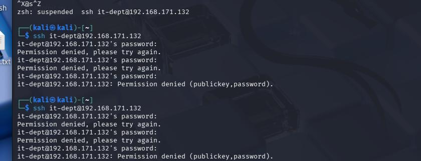

> The figure depicts an SSH Bruteforce attack wherein repeated failed SSH login attempts were generated by the attacker using invalid credentials.

### The detection

Wazuh's Threat Hunting view recorded 66 events during the attack window. The alert chain built from individual authentication failures up to a brute-force classification, and then to an automated block:

| Rule ID | Level | Rule description |
|---|---|---|
| 5760 | 5 | `sshd: authentication failed.` |
| 5503 | 5 | `PAM: User login failed.` |
| 2502 | 10 | `syslog: User missed the password more than one time` |
| 5763 | 10 | `sshd: brute force trying to get access to the system. Authentication failed.` |
| 651 | 3 | `Host Blocked by firewall-drop Active Response` |

> Figure 27 showcases the Wazuh event log under the threat hunting category, wherein multiple related security alerts were observed in its dashboard, indicating failed SSH authentication, failed PAM login attempts, and repeated incorrect password behavior. The logs confirm that Wazuh was able to monitor and detect the unusual behavior in real time. After the brute-force threshold was met, the Wazuh Active Response triggered and blocked the attacker's IP address.

| Test | Scenario | Result |
|---|---|---|
| SSH Brute-Force Attack Simulation | An attacker initiates repeated failed SSH login attempts against the Ubuntu victim machine using invalid credentials. | The brute-force activity was successfully generated for monitoring and detection validation. |
| Wazuh SSH Brute-Force Detection | The Wazuh dashboard monitors the attack while repeated failed SSH attempts occur. | Wazuh recorded multiple alerts showing failed SSH authentication, failed PAM logins, and repeated incorrect password behavior. |
| Wazuh Active Response | The brute-force threshold is met during the SSH attack. | Wazuh Active Response triggered and blocked the attacker's IP address. |

---

## 2. File integrity monitoring

Monitored department files were modified and the `syscheck` module reported the change.

| Rule ID | Level | Rule description | Monitored paths |
|---|---|---|---|
| 550 | 7 | `Integrity checksum changed.` | `c:\departmentfiles\hr\contracts.txt`, `c:\departmentfiles\hr\client_list.txt`, `c:\wazuhdemo\docus.txt` |

> Figure 28 depicts the Wazuh Events log dashboard wherein the monitoring tool was able to depict a change in the checksum of the affected .txt files.

---

## 3. Vulnerability detection

The Syscollector module inventoried the monitored Windows endpoint and Wazuh correlated the installed packages against its vulnerability feeds, returning **1,714 findings** with CVE identifiers and severity ratings for Windows 10 Pro (build 10.0.19045.2075).

| Dashboard | Inventory detail |
|---|---|
| 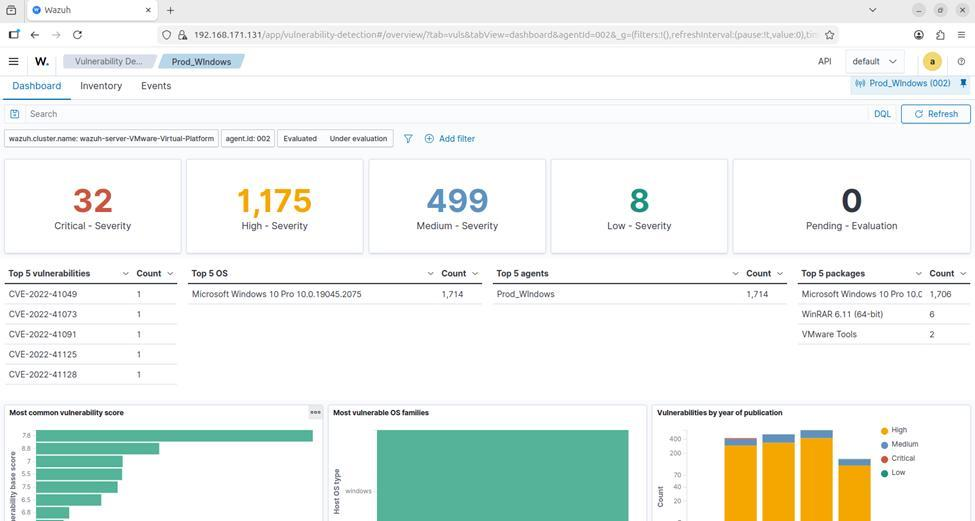 |  |

> The figure depicts the dashboard of the Wazuh Vulnerability Detection, wherein it reports the identified vulnerabilities affecting the respective Windows client being monitored by using the syscollector module. Wazuh is able to collect inventory details from the monitored endpoint.

> The figure depicts a much more detailed view of the inventory logs of the monitored endpoint after scanning, it includes the vulnerability description along with its corresponding vulnerability ID.

---

## 4. Security Configuration Assessment (CIS benchmark)

The agent ran the **CIS Microsoft Windows 10 Enterprise Benchmark v4.0.0** policy against the endpoint:

| Metric | Result |
|---|---|
| Total checks | 424 |
| Passed | 117 |
| Failed | 302 |
| Not applicable | 5 |
| Score | 27% |

> The figure depicts the dashboard of the security assessment conducted by the Wazuh agent on the target endpoint. Wazuh uses its different SCA policies, which are based on the Center of Internet Security (CIS) benchmark, to assess whether or not the endpoints are configured securely.

---

## 5. Windows Defender log visibility

464 Defender-related events were forwarded through the Wazuh agent, covering antimalware scans, definition and engine updates, real-time protection state changes, and service creation.

| Rule ID | Level | Rule description |
|---|---|---|
| 62151 | 3 | `Windows Defender: Antivirus real-time protection is enabled` |
| 62152 | 5 | `Windows Defender: Antivirus real-time protection is disabled` |
| 62130 | 3 | `Windows Defender: Antimalware definitions updated successfully` |
| 62132 | 3 | `Windows Defender: Antimalware engine updated successfully` |
| 62154 | 5 | `Windows Defender: Antimalware platform feature configuration changed` |
| 61138 | 5 | `New Windows Service Created` |

> The figure above depicts the Windows Defender-related logs acquired by the Wazuh agent on the monitored endpoint. This provides visibility on malware detections by the Windows Defender on the endpoints.

---

## 6. Malware detection — EICAR, VirusTotal, and Active Response

The EICAR anti-malware test file was downloaded onto the monitored Windows endpoint. Defender was temporarily disabled so that Wazuh's own detection and response path could be exercised end to end.

| EICAR test file source | Download on the monitored endpoint |
|---|---|
| 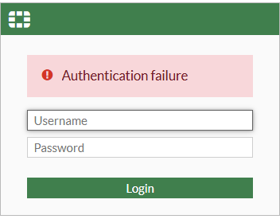 | 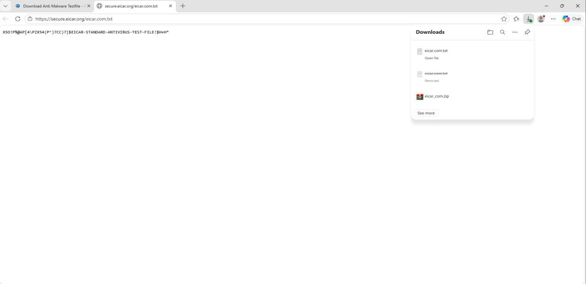 |

> The figure displays the official page that hosts the EICAR anti-malware test file, which is used for testing malware detection capabilities. The EICAR file is used to simulate a malware file in a safe environment to test whether Wazuh detects the file when uploaded to VirusTotal.

The full chain, in order:

| Rule ID | Level | Rule description |
|---|---|---|
| 554 | 5 | `File added to the system.` |
| 87105 | 12 | `VirusTotal: Alert - c:\users\prod\downloads\eicar.com.txt - 64 engines detected this file` |
| 553 | 7 | `File deleted.` (Active Response) |

> The figure shows the Wazuh dashboard displaying the recorded logs after the EICAR anti-malware test file was downloaded on the monitored endpoint. Wazuh detected the newly downloaded file by extracting and recording its file hash. The file hash was then checked through the VirusTotal API and compared with its malware database. Once VirusTotal identified the file as malicious, Wazuh generated an alert and executed an Active Response action to quarantine or delete the detected test file.

> The result confirms that Wazuh was able to detect the EICAR anti-malware test file, verify the file through VirusTotal integration, generate a security alert, and perform an automated response. This validates the capability of Wazuh to support malware detection, incident visibility, automated mitigation, and security-event analysis within the simulated environment.

---

## 7. Web application penetration testing

The cloud-hosted web application (Node.js/Express with MySQL, deployed on Railway behind Cloudflare) was attacked at its `/auth/login` endpoint.

> To assess the security of the proposed web application, brute-force and SQL injection attacks were conducted against the login endpoint. The results showed that Cloudflare rate limiting, Turnstile validation, and application logging were able to detect, record, and mitigate the attack attempts. No successful authentication bypass or SQL injection was achieved, indicating that the implemented security controls were effective in protecting the website against common web-based attacks.

### 7.1 Credential brute force (Burp Suite)

| Cloudflare blocks the source IP | `429 Too Many Requests` |
|---|---|
| 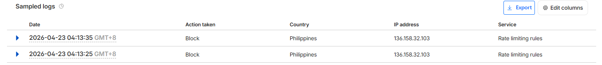 |  |

> Figure 19 depicts Cloudflare using the set security rule to block the IP address of the attacker using brute force to log into the website. Due to the attacker exceeding the rate-limiting rules set, its IP has been blocked.

> Figure 20 demonstrates how Cloudflare blocked the brute force attempt by Burp Suite by blocking its IP momentarily due to the multitude of requests being attempted, as seen by the 429 Status result, meaning "Too many Requests".

Turnstile token validation gave a second signal:

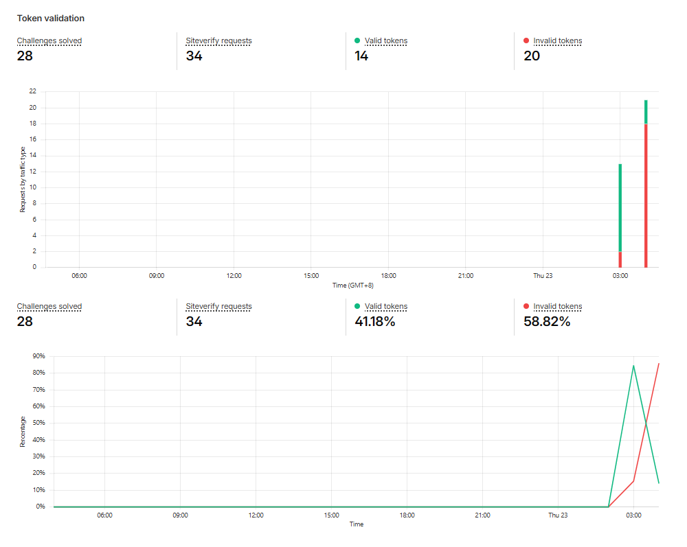

> Figure 21 illustrates the ratio of valid to invalid turnstile tokens used when accessing the website. During the Burp Suite Brute Force simulation, there is a huge increase in the amount of invalid tokens used when logging into the website, which suggests automated or replayed login attempts that were rejected because of the reused/frozen tokens.

### 7.2 Manual SQL injection

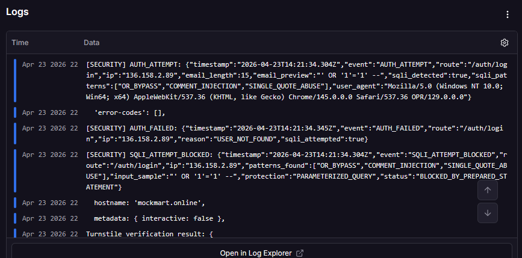

> Figure 22 illustrates how the railway captured the console log from the application displaying the attempted SQL injection by the attacker along with its respective SQL injection pattern and the input sample `' OR '1' = '1' --`.

### 7.3 Automated SQL injection (sqlmap)

| Invalid tokens generated | Requests mitigated | Rate-limit events |
|---|---|---|
| 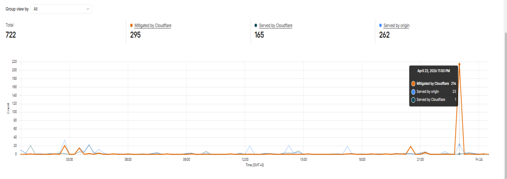 | 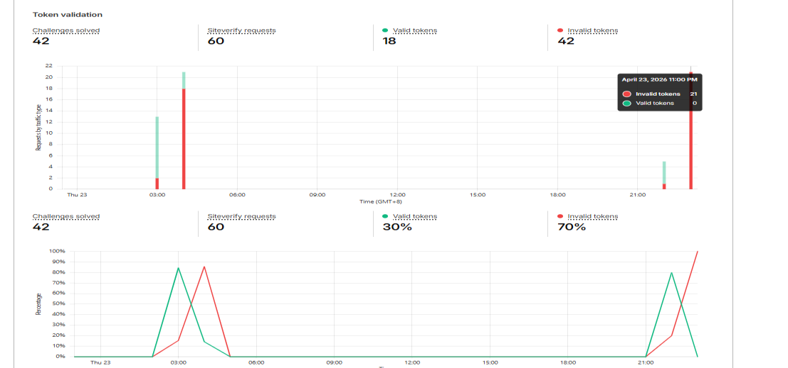 |  |

> Figure 24 shows that there was a surge of requests mitigated by Cloudflare during the time of the SQL mapping. This shows that Cloudflare successfully denied the requests for SQL and recorded them.

> Figure 25 illustrates the details of the events recorded by Cloudflare Security being mitigated by the rate-limiting rules. Due to SQL mapping sending a flood of requests to try and login, the rate-limiting rule triggered and blocked it.

### Summary

| Test | Description | Result |
|---|---|---|
| Burp Suite Brute Force | Burp Suite was used to test if the endpoint could withstand and mitigate repeated automated password attempts. The login endpoint `/auth/login` was targeted using repeated authentication requests. | The brute force attacks utilizing burp suite was successfully mitigated by Cloudflare through the use of its rate-limiting rule and the utilization of turnstile token. |
| SQL Injection | A crafted SQL-like string `' OR 1=1 --` was manually entered into the login form in hopes of logging in to the website. | The Railway application logs captured the authentication attempt and recorded the suspicious input as part of the application's security monitoring process. The request did not result in a successful authentication bypass. |
| sqlmap-Based Automated SQL Injection Testing | The login form was tested using sqlmap with POST parameters for email and password. The test generated multiple automated requests against the login form. | Because Cloudflare rate limiting, turnstile, and application logging were active, the automated test did not identify any injectable parameters. It returned multiple 400 Bad Request responses while Cloudflare generated numerous 429 Too Many Requests responses due to the SQL mapping exceeding the request threshold. The automated probing did not result in a successful SQL Injection. |

---

## 8. Firewall security policy enforcement

> The FortiGate administrative access control test validates the use of role-based administrator privileges and trusted host restrictions. The IT intern account was assigned limited read-only permissions and could only access the FortiGate management interface from an allowed IP address. Meanwhile, the super administrator account had higher-level privileges. HR clients were not allowed to access the FortiGate management interface, even with correct credentials, because their source IP addresses were not included in the trusted administrative access list.

| Web filtering | Application control |
|---|---|
| 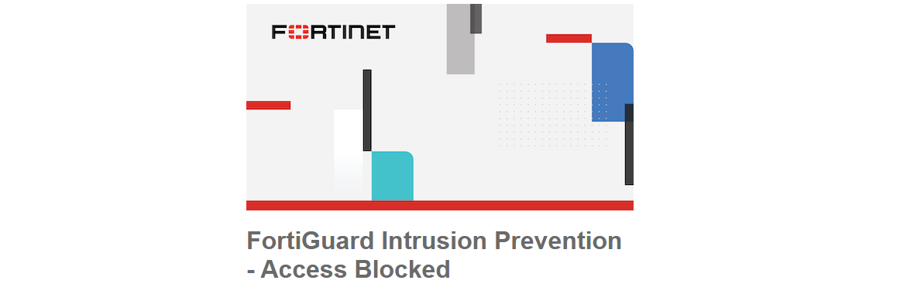 | 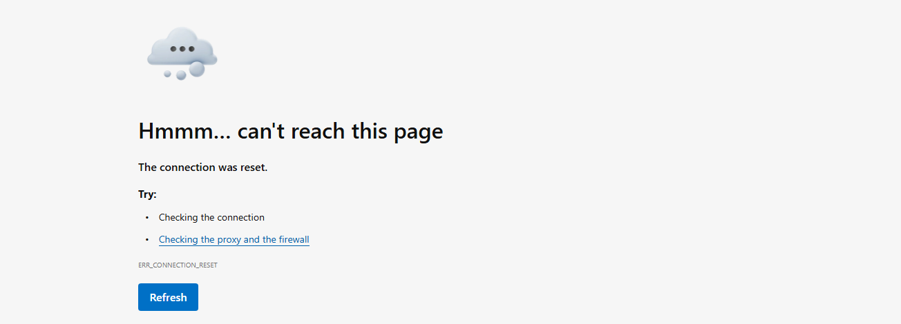 |

| Test | Scenario | Result |
|---|---|---|
| FortiGate Web Filtering | A client attempts to access websites or categories restricted by the FortiGate web filter policy. | The restricted web access was blocked according to the configured FortiGate policy, confirming that web filtering was properly enforced. |
| FortiGate Application Control | A client successfully accessed YouTube before the application control policy was applied. After enabling the policy, the client attempted to access YouTube again. | YouTube became inaccessible and displayed a "This site can't be reached" message, confirming that the application control policy restricted access to the selected application. |
| FortiGate Administrative Access Control | The IT intern account attempts to log in from an unauthorized client/IP or perform actions beyond its assigned permission level. | Access was restricted based on the configured trusted host/IP and permission profile. The IT intern account had limited read-only privileges, while the super administrator account had broader administrative access. |
| HR Client FortiGate Access Restriction | An HR client attempts to log in to FortiGate using valid administrator credentials. | Access was denied because the HR client was not part of the allowed trusted host/IP range for FortiGate administration. |

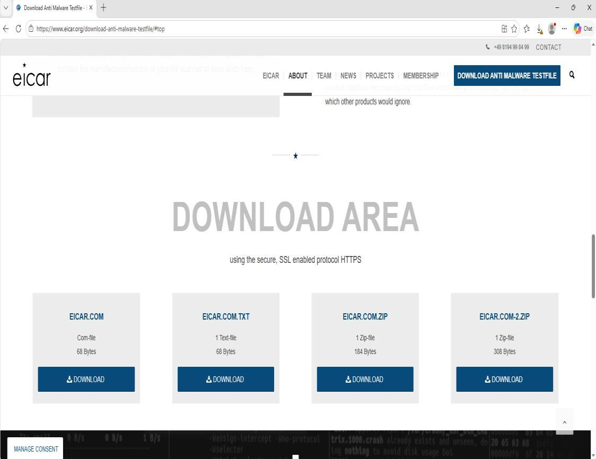

> The figure illustrates the login attempt to the FortiGate management interface that was rejected due to authentication failure. Such a rejection denies unauthorized and restricted users from accessing the FortiGate firewall.

---

**Previous:** [← Chapter 3 — Research Methodology](03-methodology.md) · **Next:** [Testing and Results →](05-testing-and-results.md)
