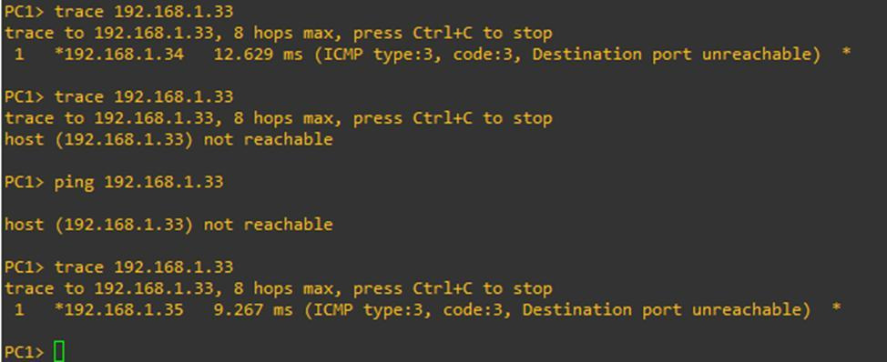
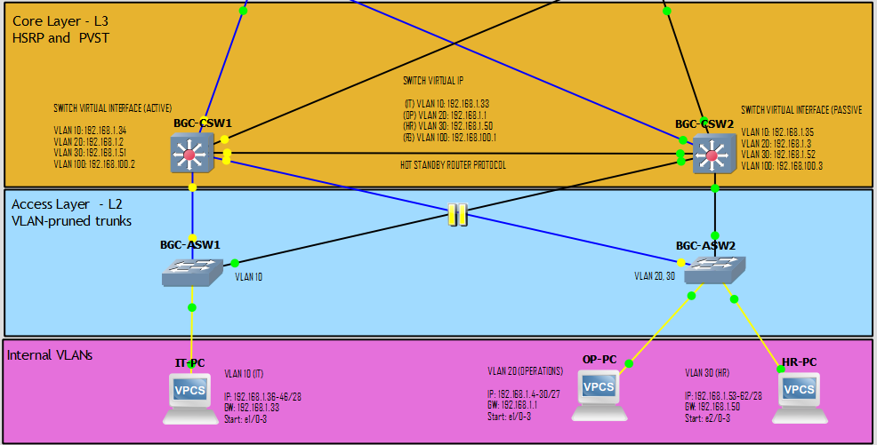
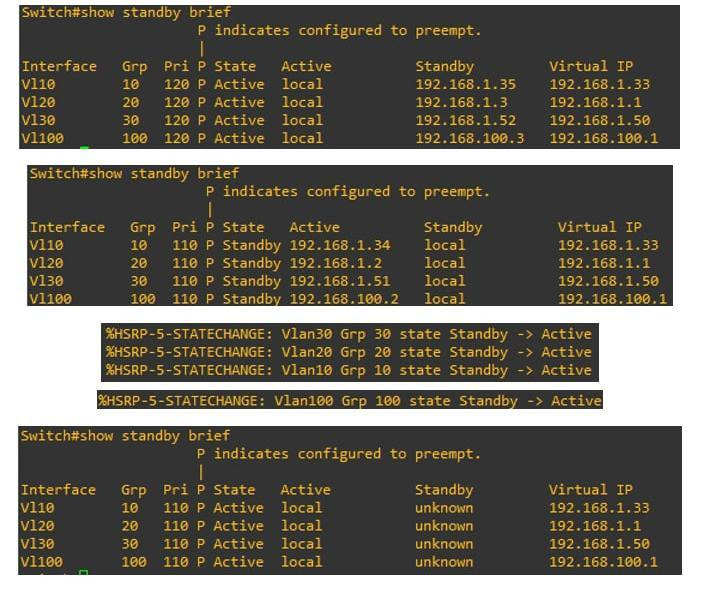
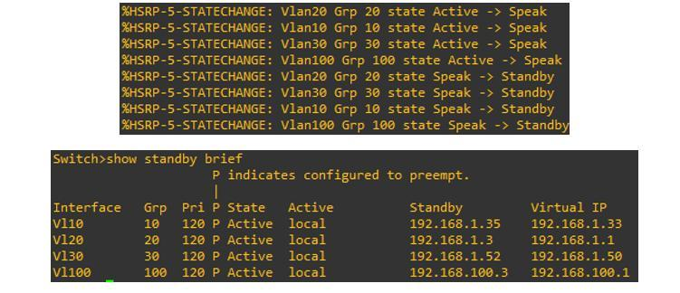
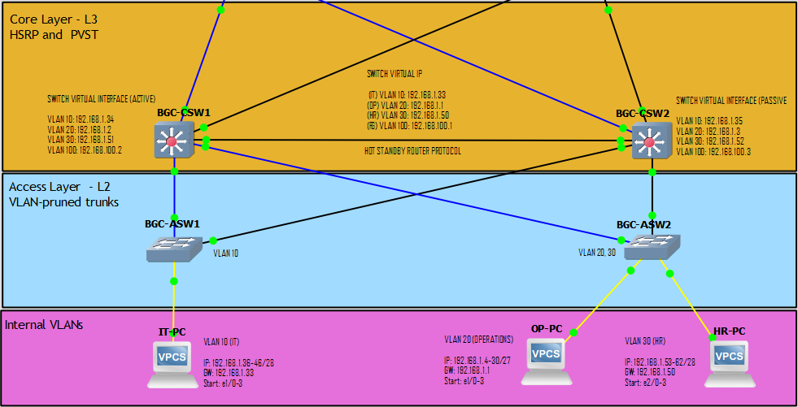
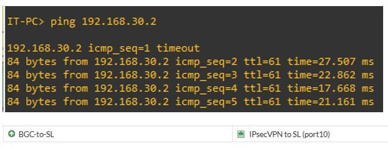
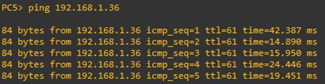
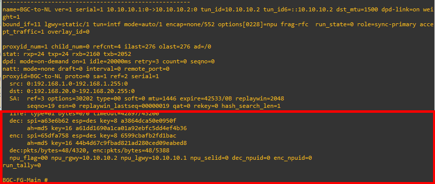

# Testing and Results

*Text in this document is taken from the capstone manuscript.*

> To evaluate functionality, reliability, security, and monitoring of the proposed system, tests have been conducted in a simulated environment to cover the functionality of the LAN, WAN, and the security of the website along with IDS/IPS. The tests were conducted to test the structure of the proposed system for maintaining the connection, for failing over in case of a problem, and for withstanding common web attacks, and for logging and security-related detection.

---

## Local Area Network

> Overall, the test results illustrate the ability of the proposed infrastructure to support HSRP-based gateway redundancy, firewall high availability, and ISP failover. The figures demonstrate the rerouting of traffic from one core switch to another standby switch, the takeover of the standby switch for the primary switch, the preemption of the primary switch by the standby switch after the primary switch is restored, the firewall failover based on the monitor and heartbeat links, and the network's ability to maintain internet connectivity through the secondary ISP during the primary ISP failure.

### HSRP gateway redundancy

| Traffic reroutes to the standby | Topology with ASW2–CSW1 link down |
|---|---|
|  |  |

> Figure 9 shows the rerouting of traffic from the active CSW1 (192.168.1.34) to the standby CSW2 (192.168.1.35) when the active is no longer reachable.

| CSW2 takes over | CSW1 preempts on recovery |
|---|---|
|  |  |

> Figure 11 depicts the HSRP configuration wherein the CSW2 takes over by changing its state from standby to active.

> Figure 12 illustrates CSW1 taking over when it goes back up as its priority is higher.

> Figure 13 showcases the restoration of ASW2 to CSW1 indicating connection has been re-established.

### Firewall high availability

> Figure 14 illustrates 2 firewalls, and through monitoring and heartbeat ports, the backup firewall takes over if the primary goes down. Upon successful takeover, it shows that the pc can still ping to the internet through the backup firewall.

### ISP failover

> Figure 15 shows that the firewall automatically uses the second ISP, which is 200.200.200.1, instead of the primary (100.100.100.1) when it is down to maintain network connectivity.

### Results

| Test | Description | Scenario / Command | Result |
|---|---|---|---|
| HSRP Rerouting from CSW1 to CSW2 | Validates gateway redundancy at the core switch layer. | The active core switch CSW1 (192.168.1.34) becomes unreachable. | Traffic was rerouted to the standby CSW2 (192.168.1.35), confirming that HSRP maintained internal gateway availability. |
| HSRP Backup Takeover | Verifies that the standby core switch can assume the active role. | CSW1 is no longer active, and CSW2 is expected to change state. | CSW2 changed from standby to active, confirming successful backup takeover. |
| HSRP Preemption / Primary Recovery | Verifies recovery behavior when the primary core switch returns online. | CSW1 becomes available again after failure. | CSW1 took over again because its priority was set higher than CSW2, confirming successful HSRP preemption. |
| Firewall High Availability Failover | Validates perimeter redundancy using dual firewalls. | The primary firewall is placed in a down state. | The backup firewall took over through the monitor and heartbeat ports, and the PC was still able to ping the internet. |
| ISP Failover | Validates continued connectivity when the primary ISP becomes unavailable. | The primary ISP path (100.100.100.1) is down. | The firewall automatically shifted to the second ISP (200.200.200.1), maintaining network connectivity. |

---

## Wide Area Network

> WAN test results illustrate the ability of the proposed infrastructure to support site-to-site IPsec VPN communications between main and remote branch locations. The results show ping success from main branch to remote branch location (SL) and vice versa. Furthermore, the IPsec tunnel statistics show non-zero values for encrypted and decrypted packets, showing that packets successfully traversed the IPsec VPN tunnel.

| Main branch → SL branch | SL branch → main branch |
|---|---|
|  |  |

> Figure 18 showcases the status of the IPsec tunnel through the usage of the `diag vpn tunnel list` command. It illustrates that packets are encrypted before transmission and decrypted upon receipt. The non-zero encrypted and decrypted values confirm that traffic is successfully passing through the IPsec VPN tunnel and is securely protected during transmission.

### Results

| Test | Description | Scenario / Command | Result |
|---|---|---|---|
| Main Branch to SL Branch Connectivity | Validates outbound inter-branch communication through IPsec VPN. | The main branch device performs a ping test to the SL branch. | The main branch was able to reach and ping the SL branch, confirming successful IPsec VPN communication. |
| SL Branch to Main Branch Connectivity | Validates return-path inter-branch communication through IPsec VPN. | The SL branch performs a ping test to the IT-PC in the main branch. | The SL branch was able to reach and ping the IT-PC in the main branch, confirming successful bidirectional branch connectivity. |
| IPsec Tunnel Encryption and Decryption Validation | Validates secure inter-branch communication through IPsec VPN. | The administrator checks the IPsec tunnel statistics during active branch communication. | The tunnel showed non-zero encrypted and decrypted values, confirming successful and secure IPsec VPN transmission. |

---

## Website penetration testing

Full detail, figures, and analysis are in [Security Monitoring and Detection §7](04-security-monitoring-and-detection.md#7-web-application-penetration-testing).

| Test | Result |
|---|---|
| Burp Suite Brute Force | The brute force attacks utilizing burp suite was successfully mitigated by Cloudflare through the use of its rate-limiting rule and the utilization of turnstile token. |
| SQL Injection | The Railway application logs captured the authentication attempt and recorded the suspicious input as part of the application's security monitoring process. The request did not result in a successful authentication bypass. |
| sqlmap-Based Automated SQL Injection Testing | The automated test did not identify any injectable parameters. It returned multiple 400 Bad Request responses while Cloudflare generated numerous 429 Too Many Requests responses due to the SQL mapping exceeding the request threshold. |

---

## Monitoring tools

> The monitoring tools configuration output shows that Wazuh successfully supported SSH brute-force detection, active response mitigation, file integrity monitoring, vulnerability detection, security configuration assessment, and Windows Defender log visibility.

| Test | Description | Scenario / Command | Result |
|---|---|---|---|
| SSH Brute-Force Attack Simulation | Validates that repeated failed SSH logins can be generated for detection testing. | An attacker initiates repeated failed SSH login attempts against the Ubuntu victim machine using invalid credentials. | The brute-force activity was successfully generated for monitoring and detection validation. |
| Wazuh SSH Brute-Force Detection | Validates real-time detection of suspicious SSH authentication behavior. | The Wazuh dashboard monitors the attack while repeated failed SSH attempts occur. | Wazuh recorded multiple alerts showing failed SSH authentication, failed PAM logins, and repeated incorrect password behavior. |
| Wazuh Active Response | Validates automated mitigation after threshold-based detection. | The brute-force threshold is met during the SSH attack. | Wazuh Active Response triggered and blocked the attacker's IP address. |
| File Integrity Monitoring | Validates detection of changes to monitored files. | A monitored .txt file is altered. | Wazuh detected the checksum change and recorded the altered file event in the dashboard. |
| Vulnerability Detection Dashboard | Validates identification of endpoint vulnerabilities. | Wazuh scans the monitored Windows endpoint using the Syscollector module. | The dashboard displayed identified vulnerabilities affecting the monitored client and collected inventory details from the endpoint. |
| Vulnerability Detection Inventory Logs | Validates detailed reporting of vulnerability information. | Detailed vulnerability records are reviewed after scanning. | Wazuh displayed inventory logs containing vulnerability descriptions and corresponding vulnerability IDs. |
| Security Configuration Assessment (SCA) | Validates configuration assessment using benchmark-based security policies. | The Wazuh agent performs SCA on the target endpoint using CIS-based policies. | The SCA dashboard showed the endpoint's security assessment results based on CIS benchmark checks. |
| Windows Defender Log Monitoring | Validates visibility of endpoint malware-related security events. | Windows Defender events are collected from the monitored endpoint through the Wazuh agent. | Wazuh displayed Defender-related logs, providing visibility into malware detections on the endpoint. |
| EICAR use case scenario | Validates endpoint security and malware detection/prevention. | The eicar malware test file is downloaded from the eicar website and monitored within the Wazuh server. | Wazuh was able to detect and quarantine the detected malware test file from eicar through the use/integration of VirusTotal API. |

---

## Firewall security policies

| Test | Scenario / Command | Result |
|---|---|---|
| FortiGate Web Filtering | A client attempts to access websites or categories restricted by the FortiGate web filter policy. | The restricted web access was blocked according to the configured FortiGate policy, confirming that web filtering was properly enforced. |
| FortiGate Application Control | A client successfully accessed YouTube before the application control policy was applied. After enabling the policy, the client attempted to access YouTube again. | YouTube became inaccessible and displayed a "This site can't be reached" message, confirming that the application control policy restricted access to the selected application. |
| FortiGate Administrative Access Control | The IT intern account attempts to log in from an unauthorized client/IP or perform actions beyond its assigned permission level. | Access was restricted based on the configured trusted host/IP and permission profile. The IT intern account had limited read-only privileges, while the super administrator account had broader administrative access. |
| HR Client FortiGate Access Restriction | An HR client attempts to log in to FortiGate using valid administrator credentials. | Access was denied because the HR client was not part of the allowed trusted host/IP range for FortiGate administration. |

---

## ISO/IEC standards-based evaluation

> Selected ISO/IEC standards were used to evaluate the proposed network infrastructure to determine whether it would be acceptable based on the quality of the systems, reliability, business continuity, information security, monitoring capabilities, and general applicability to an organization. The results indicated that the proposed infrastructure had consistently high ratings across all of the evaluation criteria.

> The average total score of **3.73 out of 4.0** is indicative of a **"Very Good"** rating. This indicates a high level of respondent satisfaction with the proposed system and confirms that it will deliver the expected standards of operation, reliability, security, and monitoring capabilities.

| Criteria | ISO/IEC Standard Basis | Average Rating | Interpretation |
|---|---|---|---|
| System Evaluation | ISO/IEC 25010, ISO/IEC 20000 | 3.74 | Very Good |
| Reliability and Business Continuity | ISO/IEC 22301, ISO/IEC 25010 | 3.78 | Very Good |
| Information Security and Network Protection | ISO/IEC 27001, ISO/IEC 27033 | 3.72 | Very Good |
| Monitoring, Logging, and Auditability | ISO/IEC 27033, ISO/IEC 20000 | 3.70 | Very Good |
| Overall Acceptability of the Proposed Infrastructure | ISO/IEC 25010, ISO/IEC 22301, ISO/IEC 27001, ISO/IEC 27033 | 3.70 | Very Good |
| **Overall Average Rating** | — | **3.73** | **Very Good** |

### Linking the evaluation to requirements

> **Security score** → The rating of 3.72 indicates a "very good". It supports the fact that the proposed security features support the requirements for information security of this system, including Site-to-Site IPsec VPN, VLAN segregation, FortiGate firewall rules, web content filtering, and application control.

> **Performance score** → The rating of 3.74 indicates a "very good". It supports the fact that the proposed infrastructure provides reliable and organized network performance through structured LAN-WAN design, VLAN segregation, inter-VLAN routing, and centrally managed traffic control.

> **Reliability and continuity score** → The rating of 3.78 indicates a "very good." It supports the fact that the proposed system has met the required levels of continuity through ISP dual-homing, ISP fail-over, FortiGate High-Availability clustering, and HSRP redundant gateways.

> **Monitoring and manageability score** → The MLA score of 3.7 signifies a "Very Good" rating. Therefore, with respect to its monitoring and management capabilities, the Wazuh solution meets all of the required criteria necessary for X Company's administrative oversight.

> **Overall acceptability score** → The overall acceptability score is also rated at 3.7, which is also a "Very Good" rating. Thus, the proposed infrastructure should be able to meet X Company's operational requirements with regard to security, reliability, availability, manageability, and monitoring.

---

**Previous:** [← Security Monitoring and Detection](04-security-monitoring-and-detection.md) · **Next:** [Conclusion and Recommendations →](06-conclusion-and-recommendations.md)
